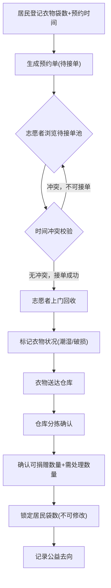

## 1. 产品概述

社区旧衣回收平台，连接居民、志愿者和公益仓库三方，实现旧衣从预约投放到分拣捐赠的全流程线上协同。居民登记衣物信息并预约上门时间，志愿者接单回收，仓库人员确认分拣结果并追踪公益去向。

- 目标用户：社区居民、社区志愿者、公益仓库管理人员
- 核心价值：让旧衣回收流程透明、高效、可追溯，减少资源浪费，推动公益循环

## 2. 核心功能

### 2.1 用户角色

| 角色 | 进入方式 | 核心权限 |
|------|----------|----------|
| 居民 | 首页选择"居民入口" | 登记衣物袋数、预约上门时间、查看回收状态、仓库确认后不可修改袋数 |
| 志愿者 | 首页选择"志愿者入口" | 浏览可接订单、接单回收、标记潮湿/破损衣物、查看已接订单 |
| 仓库人员 | 首页选择"仓库入口" | 确认可捐赠数量、确认需处理数量、标记衣物状况、追踪公益去向 |

### 2.2 功能模块

1. **角色选择页**: 三角色入口卡片，绿色环保主题
2. **居民工作台**: 新建预约、我的预约列表、回收进度追踪
3. **志愿者工作台**: 待接订单池、我的回收任务、衣物状况标记
4. **仓库工作台**: 待分拣列表、分拣确认面板、公益去向追踪
5. **流程总览页**: 全链路数据看板，预约→回收→分拣→公益去向

### 2.3 页面详情

| 页面名称 | 模块名称 | 功能描述 |
|----------|----------|----------|
| 角色选择页 | 角色入口 | 三张角色卡片，点击进入对应工作台 |
| 居民工作台 | 新建预约表单 | 填写袋数、选择上门日期时段、备注，提交后生成预约单 |
| 居民工作台 | 我的预约列表 | 展示所有预约单及状态（待接单/回收中/已分拣/已完成），仓库确认后袋数锁定不可编辑 |
| 居民工作台 | 回收进度 | 查看当前预约的流转节点和进度条 |
| 志愿者工作台 | 待接订单池 | 展示所有待接单预约，显示时间地点袋数，时间冲突的不能被同一志愿者接单 |
| 志愿者工作台 | 我的回收任务 | 已接单列表，可标记衣物状况（潮湿/破损），确认回收完成 |
| 志愿者工作台 | 衣物标记 | 对回收衣物标记潮湿/破损等特殊状况 |
| 仓库工作台 | 待分拣列表 | 展示已回收待分拣的衣物，显示袋数和特殊标记 |
| 仓库工作台 | 分拣确认 | 确认可捐赠数量和需处理数量，提交后锁定居民袋数 |
| 仓库工作台 | 公益去向 | 记录可捐赠衣物的公益去向（捐赠地区/机构） |
| 流程总览页 | 数据看板 | 统计预约数、回收数、分拣数、公益去向汇总 |
| 流程总览页 | 流程链路 | 可视化展示预约→回收→分拣→公益去向的全链路 |

## 3. 核心流程

居民在平台登记衣物袋数和预约上门时间，提交后生成预约单进入待接单池。志愿者浏览待接单池并接单，系统校验同一志愿者不可接时间冲突的订单。志愿者上门回收后标记衣物状况（潮湿/破损），将衣物送达仓库。仓库人员对衣物进行分拣，确认可捐赠和需处理数量，确认后居民不可再修改袋数。最后记录可捐赠衣物的公益去向。

## 4. 用户界面设计

### 4.1 设计风格

- 主色调：森林绿 #2D6A4F + 暖橙点缀 #E76F51，传达环保与温度
- 辅助色：米白 #FEFAE0 背景，深炭 #1B1B1E 文字
- 按钮风格：圆角胶囊按钮，绿色主按钮，橙色次要按钮
- 字体：思源黑体 Noto Sans SC 为主，数字用 Space Grotesk
- 布局风格：卡片式布局，左侧导航栏 + 右侧内容区
- 图标风格：线性图标（lucide-react），绿色为主
- 装饰元素：叶子/回收箭头的简约线条装饰

### 4.2 页面设计概览

| 页面名称 | 模块名称 | UI元素 |
|----------|----------|--------|
| 角色选择页 | 角色入口卡片 | 三列卡片布局，每张卡片含图标+角色名+简介，hover上浮+阴影动效 |
| 居民工作台 | 新建预约表单 | 居中表单卡片，日期选择器+数字输入+文本域，绿色提交按钮 |
| 居民工作台 | 预约列表 | 表格列表，状态徽章（不同颜色），已确认行袋数灰显+锁定图标 |
| 志愿者工作台 | 待接订单池 | 网格卡片，每卡显示时间地点袋数，冲突订单红色提示 |
| 志愿者工作台 | 衣物标记 | 标签式选择器（潮湿/破损/正常），选中状态高亮 |
| 仓库工作台 | 分拣确认 | 左右分栏：左侧待分拣列表，右侧确认面板（数字输入+备注） |
| 仓库工作台 | 公益去向 | 时间线样式展示捐赠记录，含地区+机构+数量 |
| 流程总览页 | 数据看板 | 顶部四个统计卡片，下方流程进度条+链路图 |

### 4.3 响应式设计

- 桌面优先设计，1024px 以上完整布局
- 平板端（768-1024px）左侧导航折叠为图标模式
- 移动端（<768px）底部Tab导航，卡片单列堆叠

### 4.4 动效设计

- 页面切换：淡入滑动过渡
- 卡片交互：hover上浮+阴影加深
- 状态变更：徽章颜色渐变过渡
- 进度条：宽度动画过渡
- 提交成功：绿色勾号弹出动画
