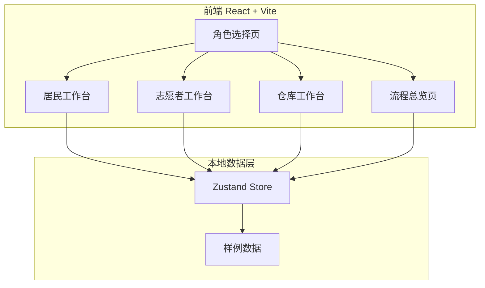
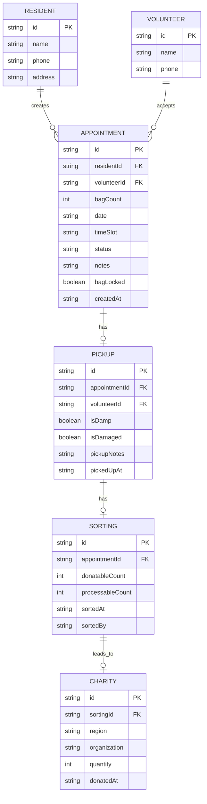

## 1. 架构设计

## 2. 技术说明

- 前端：React@18 + TypeScript + Tailwind CSS@3 + Vite
- 初始化工具：vite-init
- 后端：无（纯前端，本地样例数据）
- 数据库：无（Zustand 内存状态管理 + 本地样例数据）
- 状态管理：Zustand
- 路由：react-router-dom
- 图标：lucide-react
- 容器化：Docker + Nginx

## 3. 路由定义

| 路由 | 用途 |
|------|------|
| / | 角色选择页，三角色入口卡片 |
| /resident | 居民工作台，新建预约+我的预约 |
| /volunteer | 志愿者工作台，待接订单+我的任务 |
| /warehouse | 仓库工作台，待分拣+分拣确认+公益去向 |
| /overview | 流程总览页，数据看板+全链路展示 |

## 4. 数据模型

### 4.1 数据模型定义

### 4.2 样例数据定义

居民数据：
- resident-1: 张阿姨，138xxxx1234，阳光社区3栋501
- resident-2: 李叔叔，139xxxx5678，阳光社区7栋302
- resident-3: 王大姐，137xxxx9012，阳光社区1栋101

志愿者数据：
- volunteer-1: 小陈，136xxxx3456
- volunteer-2: 小赵，135xxxx7890

预约数据（覆盖全状态）：
- apt-1: 张阿姨，3袋，2026-06-18 上午，已分拣（已锁定）
- apt-2: 李叔叔，2袋，2026-06-18 下午，回收中
- apt-3: 王大姐，5袋，2026-06-19 上午，待接单
- apt-4: 张阿姨，1袋，2026-06-20 下午，待接单

回收数据：
- pickup-1: apt-1回收，潮湿=true，破损=false
- pickup-2: apt-2回收，潮湿=false，破损=true

分拣数据：
- sorting-1: apt-1分拣，可捐赠2，需处理1

公益去向数据：
- charity-1: sorting-1，捐赠2件至"爱心传递公益中心"，云南山区

## 5. 核心业务逻辑

### 5.1 时间冲突校验
志愿者接单时，检查该志愿者已接订单的时间段是否与新订单冲突：
- 同一天的同一时段不可被同一志愿者接单
- 时段定义：上午(9:00-12:00)、下午(13:00-17:00)、晚间(18:00-20:00)

### 5.2 袋数锁定机制
仓库完成分拣确认后，将预约单的 bagLocked 标记为 true，居民端袋数输入框变为只读

### 5.3 衣物标记
志愿者回收时标记衣物状况：
- isDamp: 潮湿标记
- isDamaged: 破损标记
- 仓库分拣时需参考标记信息

### 5.4 状态流转
预约单状态：待接单 → 回收中 → 已分拣 → 已完成
